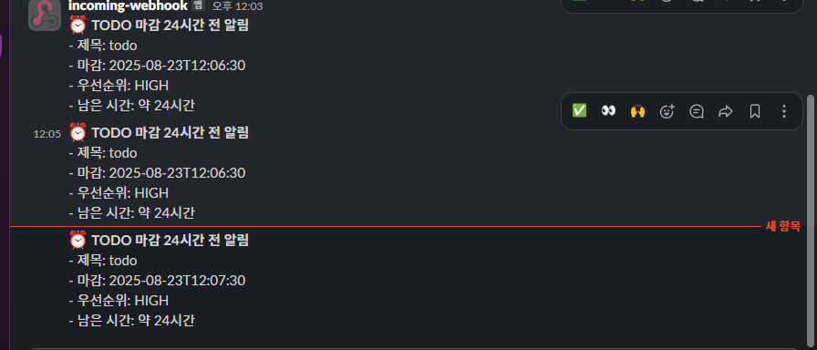
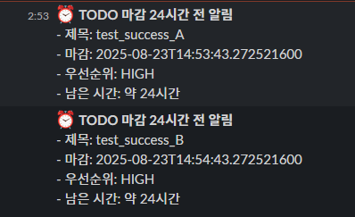
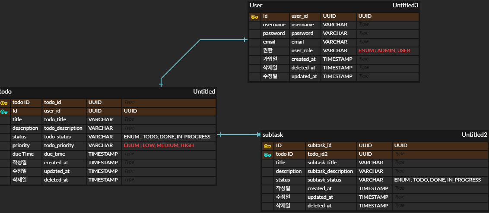

## 주요 기능

- Todo 관리
  - Todo 생성(Create), 조회(Read), 수정(Update), 삭제(Delete) 기능 제공
  - 상태(TODO, IN_PROGRESS, DONE)와 우선순위(LOW, MEDIUM, HIGH) 관리 가능
  - 모든 Subtask 가 DONE 상태일 경우 상위 Todo 의 상태 자동 갱신
  
- Subtask 관리
  - Todo 하위에 Subtask 생성 및 상태 관리
  - Subtask 상태 변경 시 상위 Todo 상태와 연동

- 캐싱
    - 사용자별 전체 Todo 목록을 캐싱하여 조회 성능 개선
    - 개별 Todo 조회 시 캐싱하여 반복 조회 성능 최적화
    - Todo 및 Subtask 변경 이벤트 발생 시 캐시 무효화 정책 적용
  
- 슬랙 알림
  - Todo의 Due Date 24시간 전 정해진 slack의 채널로 알림 발송 
  - 슬랙의 경우 따로 확인을 위해 yml 파일의 webhook uri를 변경해야함
  - 동작 확인을 위해 스케쥴러 작동 및 직접 호출한 결과 첨부

## 소스 빌드
- https://github.com/gidopa/pre_project.git clone
- ./gradlew clean build

## 전체 흐름
(로그인) → todo 생성 → subtask 생성 → todo / subtask 에 대한 update,delete 등 작업
→ 재조회를 통한 결과 확인 및 캐싱 확인

(로그인 미구현) -> todo 생성 -> subtask 생성 -> todo 리스트 조회/ 단건 조회 (캐싱) -> todo 수정
-> todo 리스트 조회/ 단건 조회 (캐싱) -> subtask 수정 -> todo 리스트 조회/ 단건 조회 (캐싱) -> subtask 삭제 
-> todo 리스트 조회/ 단건 조회 (캐싱) -> todo 삭제 

슬랙 알람의 경우 deu date의 24시간 +-3 분을 기준으로 매 5분마다 알림 발송
api 이용 시 due date를 해당 시간으로 설정 후 호출 시 슬랙 채널로 발송
슬랙 채널 이용 시 yml 파일에 있는 webhook url 수정 필요

## 주요 사용 라이브러리
- Spring Boot Starter Data JPA (spring-boot-starter-data-jpa)
  - ORM 기반의 DB 접근을 단순화하고, 엔티티 중심 설계를 통해 생산성을 높이기 위해 사용.

- Spring Boot Starter Validation (spring-boot-starter-validation)
  -  요청 DTO 유효성 검증(예: @NotBlank, @Size 등)을 자동화하기 위해 사용.

- Spring Boot Starter Cache + Caffeine (spring-boot-starter-cache, caffeine)
  - Todo 및 Subtask 조회 시 성능 개선을 위해 캐싱 적용.
  - Caffeine 은 로컬 캐싱에 적합하고, 정책(TTL, 최대 용량) 설정이 쉬워서 선택.

- Spring Webflux
  - Slack Webhook 호출은 단순 HTTP POST지만, 다수 요청 시 비동기 처리 효율이 필요했다.
  - 동기식 RestTemplate 대비 리소스 사용량이 적고, 테스트/확장이 용이.
  - 간단한 Builder 패턴으로 요청을 구성할 수 있어 Slack 같은 외부 API 연동에 적합.

- p6spy (p6spy-spring-boot-starter)
→ SQL 로그를 보기 쉽게 출력해 디버깅 및 쿼리 최적화에 활용.

## ERD

## 프로젝트 구조
- presentation 
  - 사용자/클라이언트 요청 처리 (Controller + /Response DTO)

- application 
  - 비즈니스 로직 (Service, 내부용 DTO)

- domain 
  - 핵심 비즈니스 모델 (Entity, Enum, 도메인 설정)

- infrastructure 
  - DB, Cache, 외부 라이브러리와 연결 (Repository, Config)

- exception 
  - 예외와 에러 코드 통합 관리